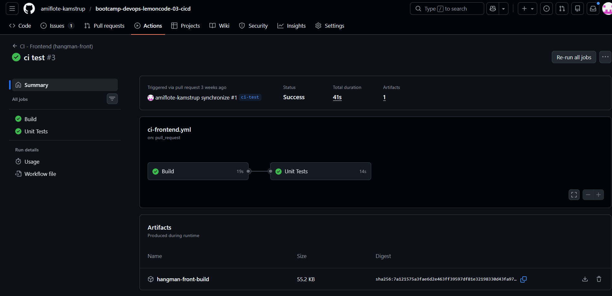
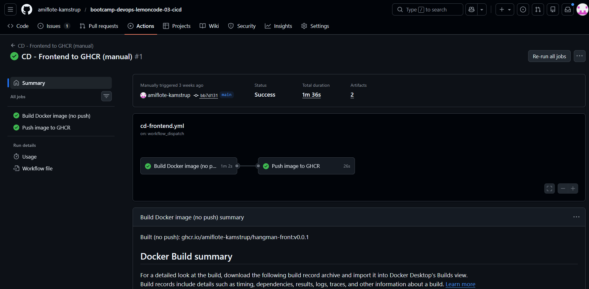
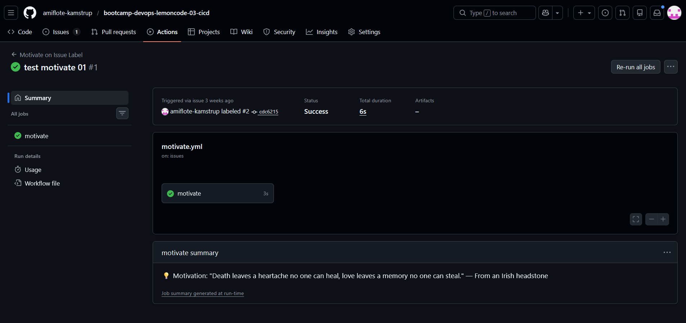

***

# GitHub Actions

## CI, CD y Custom JavaScript Action

Este repositorio contiene la solución completa al ejercicio de GitHub Actions del bootcamp. La entrega incluye tres partes:

1.  Pipeline de Integración Continua (CI) para el proyecto de frontend
2.  Pipeline de Entrega Continua (CD) para generar y publicar una imagen Docker
3.  Custom JavaScript Action que se ejecuta cuando una issue recibe la etiqueta motivate

Cada sección describe el objetivo, el enfoque adoptado y cómo se verifica la solución.

***

## 1. Pipeline de Integración Continua (CI)

### Objetivo

Garantizar que el proyecto de frontend es capaz de compilarse correctamente y que los tests unitarios se ejecutan sin errores antes de integrar cambios a través de una pull request.

El CI se dispara únicamente cuando:

*   existe una **pull request**, y
*   la PR incluye cambios dentro de `hangman-front/**`.

### Descripción del workflow

El pipeline está dividido en dos jobs:

#### Job 1: Build

*   Se ejecuta en Ubuntu
*   Instala dependencias
*   Compila el proyecto (`npm run build`)
*   Publica el artefacto de build para inspección

#### Job 2: Unit Tests

*   Depende del job de build
*   Ejecuta los tests unitarios en modo CI
*   Si los tests fallan, bloquea la PR

### Evidencias

[Enlace a la pipeline](https://github.com/amiflote-kamstrup/bootcamp-devops-lemoncode-03-cicd/actions/runs/22261900802)

***

## 2. Pipeline de Entrega Continua (CD)

### Objetivo

Construir y publicar manualmente una imagen Docker del proyecto de frontend, alojada en GitHub Container Registry (GHCR).

El pipeline CD se ejecuta manualmente mediante `workflow_dispatch` y recibe:

*   un tag opcional para versionar la imagen
*   un valor para el argumento `API_URL` del Dockerfile

### Descripción del workflow

El CD está dividido en dos jobs:

#### Job 1: Build Docker Image (image)

*   Construye la imagen Docker utilizando el Dockerfile proporcionado
*   Usa `docker/build-push-action` en modo build-only
*   Aplica caché mediante GitHub Actions Cache
*   Prepara la etiqueta final de la imagen (`vX.Y.Z`, o `<branch>-<sha>` si no se proporciona tag)

#### Job 2: Publish (publish)

*   Depende del job image
*   Hace login en GHCR
*   Reconstruye utilizando cache y publica la imagen en:  
    `ghcr.io/<owner>/hangman-front:<tag>`

### Evidencias

[Enlace a la pipeline](https://github.com/amiflote-kamstrup/bootcamp-devops-lemoncode-03-cicd/actions/runs/22262319957)

***

## 4. Custom JavaScript Action (OPCIONAL)

### Objetivo

Crear una acción personalizada de GitHub en JavaScript que se ejecute cuando una issue recibe la etiqueta motivate. La acción debe imprimir un mensaje motivacional obtenido desde el endpoint público:

    https://favqs.com/api/qotd

### Descripción de la solución

La acción se compone de:

*   `index.js`: realiza una petición HTTP al endpoint de FavQs y escribe la cita en consola y en el resumen del job.
*   `action.yml`: define la acción, especificando Node 20 como runtime.
*   `motivate.yml`: workflow que se ejecuta en eventos `issues:labeled` y filtra cuando la etiqueta aplicada es motivate.

### Evidencias

[Enlace a la pipeline](https://github.com/amiflote-kamstrup/bootcamp-devops-lemoncode-03-cicd/actions/runs/22262486487)

***

## Estructura del repositorio

    .
    ├─ hangman-front/
    │  ├─ src/
    │  ├─ config/
    │  ├─ Dockerfile
    │  ├─ entry-point.sh
    │  └─ package.json
    │
    └─ .github/
       ├─ workflows/
       │  ├─ ci-frontend.yml          ← Ejercicio 1 (CI)
       │  ├─ cd-frontend.yml          ← Ejercicio 2 (CD)
       │  └─ motivate.yml             ← Ejercicio 4 (JS Action)
       │
       └─ actions/
          └─ motivate/
             ├─ action.yml
             └─ index.js              ← Custom JavaScript Action

***

## Conclusiones

Este repositorio implementa los tres componentes solicitados:

*   Un pipeline CI dividido en build y tests, con ejecución condicionada por cambios del frontend y activado desde una PR.
*   Un pipeline CD manual que construye y publica una imagen Docker versionada en GHCR.
*   Una acción JavaScript personalizada que reacciona al etiquetado de issues y obtiene una cita motivacional desde una API pública.